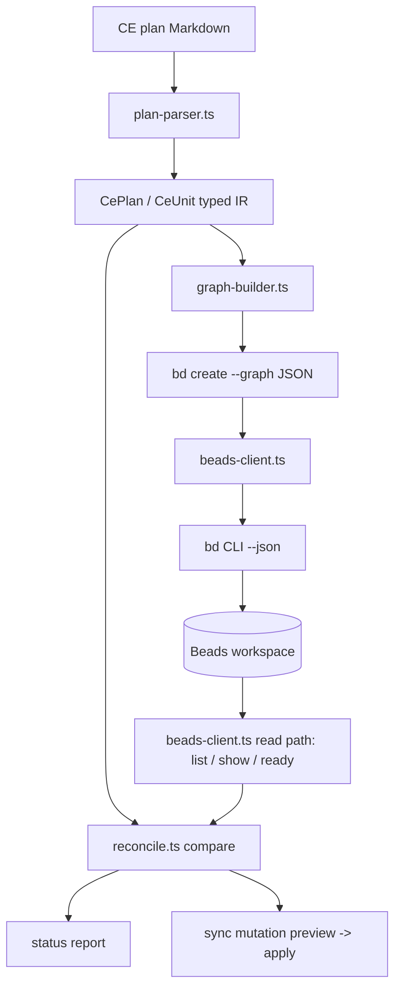
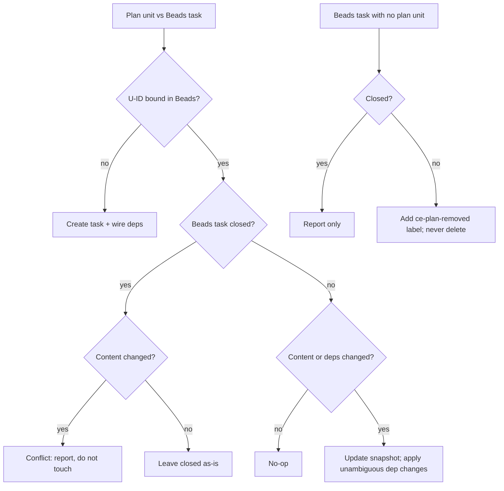

# Bootstrap ce-beads OMP-native Beads bridge - Plan

## Goal Capsule

- **Objective:** Build `ce-beads` from an empty repository into an OMP-native project skill that imports CE `ce-unified-plan/v1` implementation-ready Markdown plans into a persistent Beads dependency graph, with `doctor`, `bind`, `status`, and `sync` actions backed by deterministic Bun/TypeScript scripts and proven against the real `bd` CLI.
- **Authority hierarchy:** `ce-beads.md` (the planning brief) is the product source of truth; this plan's Planning Contract governs technical approach; pinned upstream checkouts under `upstream/` govern external contract facts. Where upstream source contradicts an assumption in this plan, upstream wins and the plan's Open Questions record the adjustment.
- **Execution profile:** A clean OMP profile with no Compound Engineering installed executes this plan as ordinary instructions. The agent never launches, nests, or spawns another OMP process and never creates or controls OMP profiles.
- **Stop conditions:** Halt and report if the installed `bd` CLI surface contradicts the pinned upstream contract in a load-bearing way (graph schema, dependency direction, metadata filtering); if a settled decision proves infeasible; or when the manual clean-profile acceptance gate (U11) is reached — that gate is a full stop awaiting the user.
- **Tail ownership:** The implementing agent owns scaffolding through automated tests and documentation. The user owns launching the acceptance profile; the agent resumes only to analyze results and fix failures.

---

## Product Contract

### Summary

ce-beads is a standalone companion project that bridges Compound Engineering implementation plans into Beads. It ships as an OMP project skill at `.omp/skills/ce-beads/` backed by deterministic Bun/TypeScript scripts: a parser turns a CE implementation-ready Markdown plan into a typed internal representation, a graph builder translates units into a Beads graph (one epic, one task per unit, blocking dependencies), and four user-facing actions — `doctor`, `bind`, `status`, `sync` — manage the binding lifecycle through the `bd` CLI only. Plans remain immutable decision artifacts; Beads owns all mutable execution state.

### Problem Frame

CE plans decompose work into dependency-ordered implementation units, but nothing persists that structure into a task tracker a clean OMP session can execute against. An executor arriving cold must re-derive unit order and progress from the plan text each time. Beads provides a dependency graph with readiness computation (`bd ready`), claims, and close semantics — exactly the execution-state layer CE deliberately does not carry. The bridge must map the CE artifact contract onto Beads faithfully (dependency direction, idempotency, drift detection) without modifying either upstream project and without requiring CE at execution time.

### Requirements

**Parsing and validation**

- R1. Parse `ce-unified-plan/v1` Markdown plans with `artifact_readiness: implementation-ready` and `execution: code` into a typed internal representation (`CePlan` / `CeUnit`), keeping the parsing boundary separate from Beads translation.
- R2. Reject unsupported inputs before any Beads mutation: requirements-only plans, knowledge-work plans, HTML plans, duplicate U-IDs, missing dependency targets, dependency cycles, missing required unit fields, unsupported artifact contracts, paths outside the current repository, and structurally uninterpretable plans.

**Binding and identity**

- R3. `bind` creates one epic representing the plan, one child task per implementation unit, and blocking dependencies derived from CE unit dependencies, via `bd create --graph` with a mandatory dry-run gate and post-apply read-back verification, returning the U-ID to Beads ID mapping.
- R4. Binding the same unchanged plan again creates no duplicate tasks and returns the existing mapping.
- R15. `bind` mutates only when no binding exists for the plan; any drifted, partial, duplicate, or malformed existing binding is reported without mutation and directed to `status`/`sync` — reconciliation is never re-import.
- R16. All four actions share one versioned machine protocol: a JSON envelope under `--json` (JSON-only stdout, human diagnostics on stderr) with structured diagnostics and a documented exit-code taxonomy, and all mutating actions require explicit approval bound to the exact approved preview via a deterministic approval token, with no prompting on non-TTY.
- R5. Cross-system identity is the canonical repo-relative plan path for the epic, and the plan path plus stable CE U-ID for each unit task, stored as searchable string metadata on the issue it identifies; titles, ordinal position, and generated Beads IDs are never used as identity.
- R6. Dependency direction is provably correct: if U2 depends on U1, then U2 is absent from the filtered readiness query (`bd ready --json --limit 0 --type task` with the binding metadata filters) while U1 is open, and closing U1 makes U2 ready. The filter is load-bearing: `bd ready` does not exclude epics by default, so an unfiltered query also returns the plan's open epic.

**Drift and reconciliation**

- R7. `status` is strictly read-only and reports: bound/unchanged units, new plan units, missing Beads tasks, changed unit contents, changed dependencies, units removed from the plan, closed Beads units whose plan unit changed, duplicate bindings, plan digest drift, and unsupported or malformed plan content — in human-readable output and stable JSON.
- R8. `sync` reconciles conservatively: creates newly added U-IDs, updates the bounded snapshot of existing open units, adds dependencies when unambiguous and reports dependency removals as conflicts with the exact corrective `bd dep remove` command (never deleting edges itself), preserves Beads IDs, never silently reopens a closed unit, never silently deletes a removed unit (marks removed open units with the `ce-plan-removed` label; removed closed units are reported and left byte-identical), treats changes to closed units as conflicts, previews the complete mutation set before applying, is idempotent on rerun, and on partial failure reports exactly what applied so a rerun is safe.
- R9. `doctor` is a read-only preflight reporting `bd` presence, tested versus installed Beads version, repository Beads initialization, plan support, existing binding health (duplicate mappings, missing tasks, dependency drift, malformed metadata), and exact corrective commands where safe — and never installs Beads or initializes a project.

**Packaging, testing, and environment**

- R10. The deliverable is an OMP-native project skill at `.omp/skills/ce-beads/` (`SKILL.md` + `scripts/` + `references/`) discovered by a fresh OMP profile and invocable as `/skill:ce-beads`, with all conversion logic in deterministic, testable Bun/TypeScript scripts.
- R11. Automated tests use Bun's test runner, exercise the real `bd` CLI in isolated temporary workspaces, and can never create issues in the development repository's real `.beads` database.
- R12. Scaffolding includes read-only upstream checkouts (`compound-engineering-plugin`, `beads`) with inspected commit SHAs and tested tool versions recorded in `UPSTREAMS.lock.json`, `upstream/` gitignored, upstream checkouts verified clean after implementation, `bd` presence checked (installed via the reviewed official checksum-verifying path only if absent), the development repository initialized with the brief's exact `bd init` flags, and actual OMP/Bun versions recorded.
- R13. Documentation covers prerequisites and WSL assumptions, architecture and source-of-truth, the supported CE contract, the Beads mapping, idempotency and reconciliation behavior, failure and recovery, how to run tests, the clean-profile acceptance procedure, known MVP limitations, and pinned upstream SHAs and tool versions.
- R14. Implementation ends at a manual acceptance gate: the agent stops and hands the user the exact launch directory, profile command, prompt, prerequisites, and expected results for a second empty OMP profile (`ce-beads-test`), then waits for the user's result; the agent never spawns OMP by any mechanism.

### Scope Boundaries

**Deferred for later**

- Claude Code integration.
- Codex integration.
- Proposing an upstream tracker-provider seam to CE (the MVP validates the mapping first).
- Cross-platform packaging beyond OMP on WSL/Linux.
- Publishing an npm package or marketplace plugin.

**Outside this product's identity**

- Modifying Compound Engineering or Beads; vendoring or editing upstream checkouts.
- Installing CE into OMP, or invoking `ce-plan`, `ce-work`, `lfg`, or any CE runtime skill.
- Live lifecycle callbacks from `ce-work`.
- HTML plans, legacy CE plans, requirements-only plan enrichment.
- Direct Dolt access; Beads MCP integration.
- Multi-agent concurrent Beads writers.
- PR or CI gates.
- `ce-compound` or `bd remember` integration.
- Writing execution progress, Beads IDs, checkboxes, or status back into CE plans.

### Outstanding Questions

- OQ1 (deferred, non-blocking): Whether the user-facing import action is named `bind` or `import`. This plan uses `bind` throughout; renaming is a mechanical alias change in `cli.ts`, `SKILL.md`, and docs, with no effect on identity or reconciliation semantics.

---

## Planning Contract

### Key Technical Decisions

- KTD1. **OMP is the first supported harness.** Build and validate the MVP as an OMP-native project skill. (session-settled: user-directed — chosen over supporting OMP, Claude Code, and Codex simultaneously: prove the integration in the harness actually used before adding portability and packaging complexity.)
- KTD2. **CE is absent from the execution environment.** Builder and acceptance-test profiles run without Compound Engineering installed; this plan is executed as ordinary OMP instructions. (session-settled: user-directed — chosen over running implementation through `ce-work`: avoid circular validation and prove the CE plan contract is consumable independently.)
- KTD3. **Standalone companion project.** The bridge is its own repository; neither CE nor Beads is forked or modified. (session-settled: user-directed — chosen over editing `ce-work` or adding Beads behavior to CE: validate the mapping and workflow before proposing an upstream seam.)
- KTD4. **OMP-native skill plus deterministic scripts.** The skill at `.omp/skills/ce-beads/` delegates all conversion to Bun/TypeScript scripts with automated tests. (session-settled: user-directed — chosen over pure natural-language skill instructions: parsing, idempotency, dependency mapping, and reconciliation need repeatable, testable behavior.)
- KTD5. **Markdown implementation-ready plans only.** Support exactly `ce-unified-plan/v1` + `implementation-ready` + `execution: code`; reject every other shape clearly. (session-settled: user-directed — chosen over supporting legacy, requirements-only, HTML, and arbitrary Markdown immediately: target the current executable contract first.)
- KTD6. **Beads only via the `bd` CLI with `--json`.** No direct Dolt access, no Beads MCP server. (session-settled: user-directed — chosen over Dolt or MCP access: the CLI is the canonical, lower-overhead interface and avoids coupling to storage internals.)
- KTD7. **Plans are immutable.** Nothing is ever written back to the CE plan file. (session-settled: user-directed — chosen over bidirectional synchronization: CE defines the plan as a decision artifact; Beads owns mutable execution state.)
- KTD8. **Idempotency is query-before-create against Beads metadata, not a CLI dedupe feature — and bind refuses drifted bindings.** bd 1.1.0 has no create-time deduplication: `--external-ref` is a filter handle only, and a repeated `bd create --graph` run creates fresh IDs. Binding state is enumerated with `bd list --json --all --limit 0 --metadata-field integration=ce-beads/v1 --metadata-field ce_plan_path=<path>` — `--all` because closed issues are excluded by default, `--limit 0` because the default page is 50 rows. Bind then branches three ways: no binding → create; complete unchanged binding → return the existing mapping; any drift, partial binding, or duplicate mapping → mutate nothing and report `binding_drift`, directing the caller to `status`/`sync`. Verified against `cmd/bd/graph_apply.go`, `docs/cli-reference/list.md`, and `internal/storage/issueops/bulk_ops.go` at the pinned Beads commit.
- KTD9. **Beads metadata is the only binding state — no sidecar state file, and recovery is checkpointless.** `status` and `sync` recompute truth on every run by comparing the freshly parsed plan against live `bd` queries. Binding discovery locates the epic by metadata, then enumerates all of its children by parent relationship — not by child metadata, so a child missing integration keys is still found and classified as a corrupt-binding conflict instead of being invisibly replaced. Sync mutations are deterministic in order, read back after each attempt, and classified applied / pending / conflict / indeterminate; a fresh rerun derives all remaining work from plan plus Beads alone and never repeats a create whose identity is already observable.
- KTD10. **Graph-import metadata values are strings only.** `bd create --graph` accepts `metadata` as `map[string]string`, unlike ordinary issue metadata which accepts arbitrary JSON. All ce-beads metadata values are compact strings (e.g. `ce_requirements: "R2,R4"`). Keys match the bd metadata key regex `[a-zA-Z_][a-zA-Z0-9_.]*`.
- KTD11. **Test isolation via `BEADS_DIR` + `bd init --stealth`.** Each integration test points `BEADS_DIR` at a fresh temporary directory and initializes with `--stealth`, giving a git-free, fully isolated Beads workspace; the development repository's real `.beads` is unreachable because `BEADS_DIR` takes precedence over tree discovery. Verified against `internal/beads/beads.go` (path search order) and the bundled Beads skill at the pinned commit.
- KTD12. **Two digest levels over versioned canonical projections, plus an epic unit roster.** Plan digest: sha256 over the raw plan file bytes, stored on the epic only as `ce_plan_digest` — it means *last fully reconciled raw plan revision* and advances only as sync's final commit-marker mutation (KTD16). Unit digest: sha256 over a versioned canonical projection of exactly the fields ce-beads owns and mutates — title, rendered description snapshot, required integration metadata, issue type, parent identity — stored per task as `ce_unit_digest`; user-owned execution state (status, assignee, user labels, notes, independently managed edges) is excluded from the projection, so execution activity never produces false content drift. The epic also stores `ce_unit_ids`, a sorted canonical JSON-array string of the last fully reconciled plan's unit roster, written at bind and updated atomically alongside `ce_plan_digest`. At compare time the live projection is re-hashed and checked against the stored `ce_unit_digest` *before* either is compared to the desired plan digest; a mismatch is a blocking externally-modified/corrupt snapshot, not silent trust.
- KTD13. **Scripts run directly under Bun; no build step.** OMP already runs under Bun, so scripts execute as `bun <script>` with TypeScript natively. `tsc --noEmit` is the typecheck gate; there is no compile artifact to ship.
- KTD14. **Closed units are read-only for `sync`.** A closed Beads issue whose plan unit changed is reported as a conflict requiring user attention, never reopened or overwritten — reopening would fabricate execution state the user did not create.
- KTD15. **One versioned machine protocol for all four actions, specified normatively in the Appendix.** Under `--json`, every action emits a shared envelope on stdout — `schema_version`, `action`, `ok`, `outcome`, an action-specific `data` object, and `diagnostics` entries with stable `code`, `severity`, and `remediation` — with human-readable output on stderr and an enumerated exit-code taxonomy. Ordinary status drift is exit 0 with a semantic `outcome`; exit codes are reserved for failures. The normative matrix (numeric codes, per-action outcome enums, `data` schemas, mutation-entry lifecycle, approval-token fields, and the skill's branch per outcome) lives in the Appendix; U12 implements it verbatim through one shared `protocol.ts`, and action handlers must not define private envelope variants.
- KTD16. **Mutations are two-phase, and apply is bound to the exact approved preview.** Preview emits the complete machine-readable mutation plan plus a deterministic approval token: SHA-256 over a versioned, canonically serialized payload containing the action, canonical plan identity, plan digest, normalized relevant Beads state, and the ordered mutation set. Apply runs only as `--apply <token>`: it acquires the per-invocation lock, recomputes the token, and requires an exact match before the first mutation. A mismatch produces zero mutations, a stable conflict diagnostic, and requires a new preview and approval — there is no bare `--yes` path. Non-TTY and `--json` invocations never prompt. The final ordered mutation of a sync set is the epic `ce_plan_digest` + `ce_unit_ids` commit-marker update (KTD12), executed only after every preceding mutation has read back successfully and no pending, blocking, conflict, or indeterminate item remains, and itself read back; a sync interrupted before the marker reruns as exactly the remaining work, potentially the marker alone. The bd CLI exposes no compare-and-swap update, so the token plus the KTD17 lock is the mitigation — the residual race is documented, not hidden.
- KTD17. **Single-writer safety is a correctness invariant, enforced by an OS-managed advisory lock.** Query-before-create is a time-of-check/time-of-use boundary: two concurrent `bind` processes can both observe no binding and both apply a graph, and bd has no metadata uniqueness constraint. ce-beads does not support or orchestrate multi-agent Beads workflows, but it enforces single-writer safety for its own mutating commands: every mutating action takes a repository-scoped advisory lock keyed by the canonical plan path, held per invocation across query, apply, and read-back (the KTD16 token — not the lock — carries approval across the preview/apply invocation boundary), and repeats the metadata query after acquiring it. The lock is an OS-managed fd-attached advisory lock whose ownership is released when the last owning process dies; a stable empty lock file may persist but is stateless and must never gate acquisition. `O_EXCL`, `mkdir`, PID files, timestamps, stale-age heuristics, and manual stale-lock deletion are forbidden as ownership primitives. A contender fails fast with the documented busy exit code.
- KTD18. **Sync never deletes dependency edges; it owns a canonical audit baseline and reports removals as conflicts.** Each unit task records its last-applied CE dependency set as `ce_dependencies` — required, versioned, canonical metadata on every unit task including dependency-free ones: a sorted, deduplicated JSON-array *string* (`"[]"` when empty, never a missing key or bare empty string). `bd dep remove` deletes by endpoint pair with no provenance selector, and Beads stores one edge per endpoint pair — so a CE-created edge that was manually removed and re-added is indistinguishable from a user edge, and no metadata scheme can prove ownership under the CLI-only constraint. Sync therefore adds desired-minus-live edges automatically, but classifies every baseline-minus-desired live edge as a conflict carrying the exact `bd dep remove <task> <blocker>` command for the user to run. A missing, malformed, or non-resolvable `ce_dependencies` value is a blocking `dependency_baseline_corrupt` state: no dependency additions, removals, or baseline rewrites until manually repaired. Edge additions apply before the baseline metadata update, which acts as the per-unit commit marker for checkpointless recovery.
- KTD19. **Duplicate or malformed identity blocks all mutation.** If an epic or unit identity resolves to more than one Beads issue, or a discovered child lacks required identity metadata, `status` and `doctor` report it as a blocking conflict and `bind` and `sync` perform zero mutations until the binding is manually repaired. Mutating against an ambiguous identity would update an arbitrary duplicate.

### High-Level Technical Design

Data flow through the bridge (one direction only; nothing writes back to the plan):



`bind` sequence, including the idempotency and dry-run gates:

```mermaid
sequenceDiagram
  participant U as User / OMP agent
  participant C as cli.ts bind
  participant PP as plan-parser
  participant BC as beads-client
  participant BD as bd CLI
  U->>C: bind docs/plans/x.md
  C->>PP: resolve + validate path, parse
  PP-->>C: CePlan IR (or rejection, exit non-zero)
  C->>BC: acquire plan-path lock; query binding by metadata
  BC->>BD: list --json --all --limit 0 --metadata-field ...
  BD-->>BC: existing issues
  alt no existing binding
    C->>BC: create --graph tmp.json --dry-run --json
    BC->>BD: dry-run
    BD-->>BC: validation result
    Note over C: dry-run failure => refuse live creation
    C-->>U: preview of full mutation set
    U->>C: approval (--apply <token>)
    C->>BC: acquire lock, recompute token, create --graph tmp.json --json
    BC->>BD: apply
    BD-->>BC: {ids: {key: id}} or indeterminate error
    C->>BC: re-query and read back epic + tasks, verify shape
    C-->>U: U-ID -> Beads ID mapping
  else complete unchanged binding
    C-->>U: existing U-ID -> Beads ID mapping, no creates
  else drifted / partial / duplicate binding
    C-->>U: binding_drift, no mutation; direct to status/sync
  end
```

`sync` per-unit reconciliation decision:



All mutations are previewed as a complete set before any apply; a partial failure reports exactly which mutations landed so a rerun converges.

### Output Structure

```text
ce-beads/
├── .gitignore                      # upstream/, node_modules, temp artifacts
├── package.json                    # Bun scripts: test, typecheck
├── tsconfig.json                   # strict TypeScript
├── UPSTREAMS.lock.json             # pinned SHAs + tested tool versions
├── README.md
├── docs/
│   ├── plans/                      # CE plans (this plan first)
│   └── acceptance.md               # clean-profile acceptance procedure
├── upstream/                       # gitignored, read-only checkouts
│   ├── compound-engineering-plugin/
│   └── beads/
├── .omp/
│   └── skills/
│       └── ce-beads/
│           ├── SKILL.md
│           ├── scripts/
│           │   ├── cli.ts              # subcommand dispatch, lock plumbing (U12)
│           │   ├── protocol.ts         # shared envelope, exit codes, token (U12)
│           │   ├── bind.ts             # bind action handler
│           │   ├── status.ts           # status action handler
│           │   ├── sync.ts             # sync action handler
│           │   ├── doctor.ts           # doctor action handler
│           │   ├── plan-parser.ts      # Markdown -> CePlan IR + validation
│           │   ├── beads-client.ts     # typed bd CLI wrapper (--json)
│           │   ├── graph-builder.ts    # IR -> graph JSON
│           │   └── reconcile.ts        # compare engine + sync mutation planner
│           └── references/
│               ├── mapping.md          # CE contract -> Beads mapping rules
│               └── reconciliation.md   # status/sync semantics
└── tests/
    ├── fixtures/plans/             # 14 plan fixtures per brief
    ├── helpers/                    # isolated BEADS_DIR workspace helper
    ├── plan-parser.test.ts
    ├── beads-client.test.ts
    ├── graph-builder.test.ts
    ├── cli.test.ts
    ├── bind.test.ts
    ├── status.test.ts
    ├── sync.test.ts
    ├── doctor.test.ts
    └── docs.test.ts
```

### Assumptions

- The execution machine is WSL/Linux with Bun and OMP installed; the project repository is the current directory (`~/Development/AI/ce-beads`), confirmed at scoping in place of the brief's `~/dev/ce-beads` preference.
- `bd` 1.1.0 is present on this machine; if absent on a future executor's machine, the official checksum-verifying installer is run only after inspecting the checked-out installation docs/script in `upstream/beads`.
- OMP's `/skill:ce-beads` invocation and project-skill discovery (ancestor `.omp/skills/<name>/SKILL.md` with required `description`) hold as verified against OMP 17.0.5 sources; U9 verifies discovery on the installed runtime rather than trusting the source read.
- The builder profile's `--no-skills --no-rules` launch disables all skill discovery including this project's skill — acceptable because the builder executes this plan as instructions; the acceptance profile must launch without `--no-skills`.

---

## Implementation Units

| U-ID | Title | Key files | Depends on |
|---|---|---|---|
| U1 | Project scaffolding and upstream pins | package.json, tsconfig.json, .gitignore, UPSTREAMS.lock.json | — |
| U2 | Plan fixtures and CE plan parser | .omp/skills/ce-beads/scripts/plan-parser.ts, tests/fixtures/plans/, tests/plan-parser.test.ts | U1 |
| U3 | Beads CLI client | .omp/skills/ce-beads/scripts/beads-client.ts, tests/beads-client.test.ts | U1 |
| U4 | Graph builder | .omp/skills/ce-beads/scripts/graph-builder.ts, tests/graph-builder.test.ts | U2, U3 |
| U12 | CLI foundation and output protocol | .omp/skills/ce-beads/scripts/cli.ts, tests/cli.test.ts | U1 |
| U5 | bind command | .omp/skills/ce-beads/scripts/bind.ts, tests/bind.test.ts | U4, U12 |
| U6 | status command and compare engine | .omp/skills/ce-beads/scripts/reconcile.ts, .omp/skills/ce-beads/scripts/status.ts, tests/status.test.ts | U4, U12 |
| U7 | sync command | .omp/skills/ce-beads/scripts/reconcile.ts, .omp/skills/ce-beads/scripts/sync.ts, tests/sync.test.ts | U6 |
| U8 | doctor command | .omp/skills/ce-beads/scripts/doctor.ts, tests/doctor.test.ts | U2, U3, U6, U12 |
| U9 | OMP skill package and references | .omp/skills/ce-beads/SKILL.md, .omp/skills/ce-beads/references/ | U5, U6, U7, U8 |
| U10 | Documentation | README.md, docs/acceptance.md | U9 |
| U11 | Clean-profile acceptance gate | docs/acceptance.md | U10 |

### Phase: Foundation

### U1. Project scaffolding and upstream pins

- **Goal:** A runnable Bun/TypeScript project skeleton with pinned, read-only upstream checkouts and a verified toolchain, ready for feature work.
- **Requirements:** R12
- **Dependencies:** none
- **Files:** `package.json`, `tsconfig.json`, `.gitignore`, `UPSTREAMS.lock.json`, `upstream/compound-engineering-plugin/`, `upstream/beads/`
- **Approach:** Initialize `package.json` (Bun, strict TS, `test` and `typecheck` scripts) and `tsconfig.json` (strict mode, ES modules). Establish a fully local reproducible toolchain: exact-version `typescript` and `@types/bun` devDependencies, the compatible Bun version recorded in `packageManager` and the README, a committed `bun.lock`, and a `typecheck` script that resolves the local `tsc` — clean setup runs `bun install --frozen-lockfile` before any gate, with no reliance on globally installed packages. Shallow-clone both upstream repositories into `upstream/`, record each inspected commit SHA plus the tested `bd` version in `UPSTREAMS.lock.json`, and add `upstream/` to `.gitignore`. Check `bd --version`; only if absent, inspect the checked-out installation documentation/script in `upstream/beads` and install via the official checksum-verifying path — never execute an unreviewed remote script. Initialize the development repository's Beads workspace with `bd init --non-interactive --init-if-missing --skip-agents --skip-hooks --stealth`. Record actual OMP and Bun versions in `UPSTREAMS.lock.json`.
- **Patterns to follow:** The brief's bootstrap list (origin: `ce-beads.md`) is the authoritative step order.
- **Test scenarios:**
  - `bun run typecheck` passes on the empty scaffold.
  - `UPSTREAMS.lock.json` parses and contains both upstream SHAs, the `bd` version, and OMP/Bun versions.
  - `.gitignore` covers `upstream/`; `git status` shows no upstream files tracked.
  - `bd --version` succeeds and matches the recorded version.
- **Verification:** Scaffold typechecks; upstream clones exist at the recorded SHAs; dev repo `.beads` initialized; lock file complete.

### Phase: Core

### U2. Plan fixtures and CE plan parser

- **Goal:** A typed parsing boundary that turns a supported CE plan into `CePlan`/`CeUnit` and rejects every unsupported shape before any downstream consumer runs.
- **Requirements:** R1, R2, R11
- **Dependencies:** U1
- **Files:** `.omp/skills/ce-beads/scripts/plan-parser.ts`, `tests/fixtures/plans/` (14 fixtures), `tests/plan-parser.test.ts`
- **Approach:** Parse YAML frontmatter and validate the artifact contract literally: `artifact_contract: ce-unified-plan/v1`, `artifact_readiness: implementation-ready`, `execution: code` — no aliasing of historical drift such as `plan_type`. Extract units from `### U<N>.` headings with the canonical bold-label fields (`**Goal:**`, `**Requirements:**`, `**Dependencies:**`, `**Files:**`, `**Approach:**`, optional `**Execution note:**` and `**Technical design:**`, `**Patterns to follow:**`, `**Test scenarios:**`, `**Verification:**`), where multiline values are label bullets with indented nested bullets. Validate: unique U-IDs, dependency targets exist, dependency graph is acyclic, required fields present (per the ce-plan hard floor: Goal, Requirements, Dependencies, Files, Approach, Patterns to follow, Test scenarios, Verification), and the resolved path stays inside the repository. Compute the plan digest (KTD12). The parser never touches Beads.
- **Patterns to follow:** Contract facts from `upstream/compound-engineering-plugin/skills/ce-plan/references/plan-sections.md` (section registry, metadata names) and `skills/ce-plan/SKILL.md` (unit heading and field labels), cross-checked against a real implementation-ready plan in the checkout.
- **Test scenarios:**
  - Happy path: minimal valid fixture parses into one unit with all required fields populated.
  - Happy path: three-unit linear fixture parses with dependency edges U2→U1, U3→U2.
  - Happy path: optional fields (`Execution note`, `Technical design`) parse when present and are absent (not empty strings) when omitted.
  - Rejection: requirements-only fixture rejected with a contract error before any Beads call.
  - Rejection: knowledge-work fixture (`execution: knowledge-work`) rejected.
  - Rejection: duplicate U-ID fixture rejected naming the duplicated ID.
  - Rejection: missing dependency target rejected naming the dangling reference.
  - Rejection: cyclic dependency fixture rejected with the cycle reported.
  - Rejection: malformed frontmatter rejected with a frontmatter error.
  - Rejection: HTML fixture rejected explicitly (extension and/or missing frontmatter contract).
  - Rejection: plan path resolving outside the repository rejected.
  - Rejection: a unit missing `**Test scenarios:**` rejected as missing required field.
- **Verification:** All 14 fixtures behave as specified; parser output is fully typed with no `any`; no file outside `tests/fixtures/plans/` is needed by parser tests.

### U3. Beads CLI client

- **Goal:** A thin, typed wrapper over the `bd` CLI that every other module uses, with isolated-workspace support for tests.
- **Requirements:** R6, R11
- **Dependencies:** U1
- **Files:** `.omp/skills/ce-beads/scripts/beads-client.ts`, `tests/helpers/beads-workspace.ts`, `tests/beads-client.test.ts`
- **Approach:** Wrap `bd` invocations as async functions returning parsed `--json` output typed against the observed shapes: create → single issue object; list/ready → issue-with-counts arrays; show → details array; graph create → `{ids: {key: id}}`. Surface non-zero exits as typed errors carrying stderr — and classify them (a graph-apply error after the write boundary is *indeterminate*, not "nothing applied"; callers must re-query). Provide one binding-enumeration primitive (`bd list --json --all --limit 0` with metadata filters, KTD8) plus parent-child enumeration for binding discovery (KTD9). Include `bd dep add`, `bd dep remove`, dependency read (via show), `bd update` (including `--claim`, `--set-metadata`, `--add-label`), `bd close`, and `bd label` wrappers needed by later units. The readiness wrapper is the filtered query `bd ready --json --limit 0 --type task` with the binding metadata filters (`integration=ce-beads/v1`, canonical `ce_plan_path`) — unfiltered `bd ready` returns the open epic alongside unit tasks (verified at the pinned commit: ready excludes gate/molecule/infra types, not epics). Every invocation receives an immutable child environment with the target `BEADS_DIR` — never mutate `process.env.BEADS_DIR` (parallel tests would race) — and workspace init runs with `cwd` set to a non-git temp root, because `bd init --stealth` also writes `.git/info/exclude` for the process cwd (KTD11). Test wrappers require an explicit workspace; there is no ambient default.
- **Patterns to follow:** JSON field names from `upstream/beads/internal/types/types.go`; command surfaces from `upstream/beads/docs/cli-reference/`; stealth cwd side effect from `upstream/beads/cmd/bd/init.go` and `init_stealth.go`.
- **Test scenarios:**
  - Happy path: in an isolated workspace, create an issue via the client and read it back with matching title and metadata.
  - Happy path: the filtered readiness wrapper returns only open, unblocked unit tasks — never the epic.
  - Happy path: `dep add` then filtered ready shows the dependent blocked until the blocker closes (direction proven here at the client level); `dep remove` restores readiness.
  - Enumeration: the binding-enumeration primitive returns closed issues and more than 50 issues (seed 60), proving `--all --limit 0`.
  - Error path: a failing `bd` command surfaces stderr and exit code, not a thrown string.
  - Isolation: with `BEADS_DIR` set to a temp workspace, the development repository's `.beads` is never read or written — snapshot the real database from a separate explicitly-routed process before and after the suite, and fingerprint `.git/info/exclude` to prove init's cwd side effect never fired in the repo.
  - Isolation: two parallel test workspaces do not see each other's issues.
- **Verification:** Client tests run the real `bd` binary; no mocks; temp workspaces are removed after the suite.

### U4. Graph builder

- **Goal:** Pure translation from `CePlan` IR to `bd create --graph` JSON, including epic, unit tasks, dependencies, metadata, and bounded task descriptions.
- **Requirements:** R3, R5, R10
- **Dependencies:** U2, U3
- **Files:** `.omp/skills/ce-beads/scripts/graph-builder.ts`, `tests/graph-builder.test.ts`
- **Approach:** Emit the graph schema verified upstream: `nodes` with required `key` and `title`, `type` (`epic` for the plan node, `task` for units), `description`, `labels`, string-valued `metadata`, and `parent_key` linking unit tasks to the epic; `edges` with `from_key` = dependent unit, `to_key` = blocker unit, type `blocks`. Node keys derive from stable identity (plan path hash + U-ID), not titles. Epic metadata: `integration: ce-beads/v1`, `ce_plan_path`, `ce_plan_digest`, `ce_artifact_contract`, `ce_unit_ids` (sorted canonical JSON-array string of the plan's unit roster, KTD12). Unit metadata: `integration`, `ce_plan_path`, `ce_unit_id`, `ce_unit_digest` (hash of the versioned canonical projection of ce-beads-owned fields, KTD12), `ce_requirements` (comma-joined), `ce_dependencies` (required sorted, deduplicated JSON-array string, `"[]"` when empty, KTD18). All values are strings (KTD10). Descriptions carry the bounded execution snapshot — goal, requirement IDs, files, approach, execution note, patterns, test scenarios, verification, source plan path + U-ID — not the whole plan, and never the raw plan digest (KTD12 keeps that on the epic only). Pure function: no `bd` invocation, fully unit-testable.
- **Patterns to follow:** Schema verbatim from `upstream/beads/cmd/bd/graph_apply.go` (`GraphApplyPlan`/`GraphApplyNode`/`GraphApplyEdge`).
- **Test scenarios:**
  - Happy path: linear fixture produces 1 epic + 3 task nodes, 2 edges, each task's `parent_key` = epic key.
  - Direction: the U2→U1 edge has `from_key` = U2's key and `to_key` = U1's key (asserted explicitly so an inverted graph fails this test).
  - Independence: the parallel-units fixture produces zero edges between the independent units.
  - Metadata: every node carries the required string-valued metadata keys, including `ce_unit_ids` on the epic and `ce_unit_digest` and `ce_dependencies` (canonical JSON-array string, `"[]"` for dependency-free units) on tasks; `ce_requirements` joins IDs with commas.
  - Boundedness: descriptions include all snapshot sections and exclude unrelated plan content (assert absence of another unit's goal text).
  - Schema: emitted JSON validates against the upstream node/edge field set (no unknown top-level node fields, which bd silently drops).
- **Verification:** Golden JSON output for the linear and parallel fixtures is stable across runs (deterministic key derivation).

### Phase: Commands

### U12. CLI foundation and output protocol

- **Goal:** `cli.ts` owns subcommand dispatch and the shared machine protocol (KTD15, KTD16) so all four actions speak one contract.
- **Requirements:** R16
- **Dependencies:** U1
- **Files:** `.omp/skills/ce-beads/scripts/cli.ts`, `.omp/skills/ce-beads/scripts/protocol.ts`, `tests/cli.test.ts`
- **Approach:** Subcommand-first dispatch (`cli.ts bind <plan-path> [--json] [--apply <token>]`). `protocol.ts` implements the normative protocol appendix (KTD15) verbatim — the versioned JSON envelope, per-action outcome enums, `data` schemas, diagnostic codes, exit-code taxonomy, and approval-token computation — and is the only place these are defined; action handlers consume it and must not define private envelope variants. Ordinary drift is exit 0 with a semantic `outcome`. `cli.ts` provides the shared preview/apply plumbing (KTD16): preview emits the full machine-readable mutation plan plus the approval token; apply requires `--apply <token>`, recomputes under the lock, and aborts with zero mutations on mismatch; non-TTY never prompts. `cli.ts` also provides the repo-scoped plan-path advisory-lock primitive (KTD17) used by mutating actions.
- **Test scenarios:**
  - Happy path: each subcommand dispatches and unknown subcommands exit with the usage code and a structured diagnostic.
  - Protocol: under `--json`, stdout parses as the envelope for success and failure paths; stderr carries no JSON.
  - Protocol: exit codes match the taxonomy matrix for each induced failure class.
  - Approval: without `--apply <token>`, a mutating action emits the preview plus token and mutates nothing; a wrong or stale token aborts with zero mutations and the conflict diagnostic; piped stdin (non-TTY) never blocks on a prompt.
  - Lock: a held lock makes a second mutating invocation fail fast with the busy exit code; a holder SIGKILLed mid-apply releases the lock automatically, and a fresh process acquires it and converges.
- **Verification:** The protocol matrix is asserted field-by-field; no action handler reimplements envelope, exit, approval, or lock logic.

### U5. bind command

- **Goal:** `bind <plan-path>` imports a plan into Beads idempotently, refusing to mutate against any existing drifted, partial, or duplicate binding.
- **Requirements:** R3, R4, R5, R6, R15, R16
- **Dependencies:** U4, U12
- **Files:** `.omp/skills/ce-beads/scripts/bind.ts`, `tests/bind.test.ts`
- **Approach:** Bind flow: resolve and validate the repo-relative plan path; parse via U2 (rejection exits non-zero before any `bd` mutation); take the plan-path lock and enumerate existing binding state via U3 (KTD8) including parent-child discovery (KTD9). Three explicit branches: **no binding** → build the graph (U4), run `bd create --graph <tmp> --dry-run --json`, refuse on validation failure, emit the preview plus approval token, and on `--apply <token>` acquire the lock, recompute the token, apply on exact match, read back epic + tasks, and verify count, parent links, and edges before returning the U-ID → Beads ID mapping; **complete unchanged binding** → return the existing mapping, zero creates; **any drift, partial, duplicate, or malformed binding** → zero mutations, typed `binding_drift` outcome directing the caller to `status`/`sync`. A non-zero live apply is classified indeterminate: re-query and verify metadata identities before reporting, never blindly rerun create. Duplicate or malformed identity anywhere in the binding blocks mutation entirely (KTD19).
- **Execution note:** Start with a failing integration test for the linear fixture's bind → ready → close → ready chain; it pins the dependency direction end to end.
- **Patterns to follow:** Graph apply semantics and dry-run behavior from `upstream/beads/cmd/bd/graph_apply.go` (transactional body with a post-commit Dolt boundary — hence indeterminate-error handling).
- **Test scenarios:**
  - Happy path: binding the linear fixture in an isolated workspace creates exactly 1 epic and 3 tasks; the returned mapping covers U1–U3.
  - Direction: after binding the linear fixture, the filtered readiness query exposes only U1's task (not the epic); closing U1 exposes U2; closing U2 exposes U3.
  - Independence: binding the parallel fixture leaves all independent units ready together.
  - Idempotency: rebinding the unchanged plan creates zero new issues and returns the same Beads IDs.
  - Refusal: binding after the plan changed (digest drift), after adding a unit, with a task manually deleted, and with injected duplicate unit metadata — each asserts zero mutations, unchanged issue IDs/counts, and a `binding_drift` outcome.
  - Gate: a graph the dry-run rejects (induced via builder-level fault injection, e.g. an unknown node field combination) results in no live creation.
  - Concurrency: two bind processes released through a barrier — exactly one epic/task set exists afterward; the loser exits with the busy or drift outcome and both callers can resolve the same mapping.
  - Indeterminate apply: a live edge-failure injection proves callback rollback leaves zero issues; an error-after-write injection proves bind re-queries and reports the actual state instead of claiming nothing applied.
  - Verification: read-back catches a mismatched task count (assert bind fails loudly rather than returning a partial mapping).
  - Rejection: binding a requirements-only fixture mutates nothing (workspace issue count stays zero).
- **Verification:** All scenarios pass against the real `bd` CLI in isolated workspaces; mapping output follows the U12 envelope and is stable.

### U6. status command and compare engine

- **Goal:** `status <plan-path>` reports every drift class between the current plan and Beads state, strictly read-only, in human and stable JSON form.
- **Requirements:** R7, R15, R16, R11
- **Dependencies:** U4, U12
- **Files:** `.omp/skills/ce-beads/scripts/reconcile.ts`, `.omp/skills/ce-beads/scripts/status.ts`, `tests/status.test.ts`
- **Approach:** `reconcile.ts` owns the compare engine: parse the plan (U2), discover the binding via epic metadata plus parent-child enumeration (KTD9), then classify each plan unit and each discovered Beads issue into the drift classes: unchanged, new-in-plan, missing-in-Beads (blocking — a bound task deleted outside ce-beads; sync performs no recreation and the remediation is manual repair, never a silent new Beads ID), content-changed (live canonical projection re-hashed and validated against the stored `ce_unit_digest` first, KTD12), dependencies-changed (baseline vs live vs desired, KTD18), removed-from-plan, closed-but-changed, duplicate-binding, corrupt-binding (child missing required identity metadata), externally-modified (live projection hash ≠ stored `ce_unit_digest`, blocking), dependency-baseline-corrupt (missing or malformed `ce_dependencies`, blocking), digest-drift (epic `ce_plan_digest` ≠ current raw plan digest — means the plan moved past the last fully reconciled revision), malformed-plan. Duplicate, corrupt, externally-modified, missing-in-Beads, and dependency-baseline-corrupt states are blocking classifications (KTD19). The engine consumes normalized Beads state only through the U3 client, never raw CLI JSON. `status` renders the classification read-only via the U12 envelope; `sync` (U7) consumes the same classification to plan mutations.
- **Patterns to follow:** Metadata filtering flags from `upstream/beads/docs/cli-reference/list.md`.
- **Test scenarios:**
  - Happy path: after a fresh bind, status reports all units unchanged with zero drift.
  - Drift: revised fixture adding U4 reports exactly one new-in-plan unit.
  - Drift: revised fixture changing open U2's content reports U2 as content-changed.
  - Drift: revised fixture changing already-closed U1 reports U1 as closed-but-changed.
  - Drift: revised fixture removing U2 reports U2 as removed-from-plan.
  - Drift: edited dependency set (linear fixture with U3 re-parented onto U1) reports dependencies-changed for U3.
  - Drift: hand-duplicated binding (second task with the same `ce_unit_id` metadata, created via the client) is reported as duplicate-binding and marked blocking.
  - Drift: a bound task stripped of its `ce_unit_id` metadata is still discovered via the parent relationship and reported as corrupt-binding.
  - Drift: adding an unrelated unit moves the epic digest but leaves unchanged closed tasks classified unchanged (no false per-unit drift).
  - Drift: plan edited after bind reports digest-drift on the epic comparison.
  - Read-only: the workspace's issue count, statuses, and metadata are byte-identical before and after status runs.
  - Output: `--json` parses, carries `schema_version`, and each drift class appears under a stable key.
- **Verification:** Every drift class is detected without mutation; JSON shape is asserted field-by-field in tests.

### U7. sync command

- **Goal:** `sync <plan-path>` applies the conservative reconciliation of R8: preview first, mutate only what is unambiguous and CE-owned, and converge safely on rerun.
- **Requirements:** R8, R16, R11
- **Dependencies:** U6
- **Files:** `.omp/skills/ce-beads/scripts/reconcile.ts`, `.omp/skills/ce-beads/scripts/sync.ts`, `tests/sync.test.ts`
- **Approach:** Sync takes the plan-path lock, builds the U6 classification, and refuses all mutation on any blocking state (duplicate, corrupt, externally-modified, missing-in-Beads, or dependency-baseline-corrupt). Otherwise it computes the complete mutation set — creates for new U-IDs, description/metadata updates for changed open units, dependency additions for desired-minus-live edges, dependency-removal conflicts carrying exact `bd dep remove` commands (KTD18), `ce-plan-removed` labels for removed open units, removal of exactly the `ce-plan-removed` label (all other labels preserved) from a uniquely bound open task whose U-ID returned to the plan — emits the full preview plus approval token via U12, and applies only via `--apply <token>` after recomputation matches under the lock. The final ordered mutation is the epic commit marker (`ce_plan_digest` + `ce_unit_ids`, KTD12/KTD16), applied only when every preceding mutation read back clean and no pending, blocking, conflict, or indeterminate item remains, and itself read back. Closed units are never reopened or overwritten (KTD14); closed-but-changed units and ambiguous dependency changes are conflicts, not mutations. Removed units are labeled, never deleted; removed closed units are reported only. Mutations are deterministic in order, read back after each attempt, and reported as applied / pending / conflict / indeterminate (KTD9): a fresh rerun derives all remaining work from plan plus Beads alone — after an interruption, potentially only the epic commit marker — and never repeats a create whose identity is already observable. Edge additions apply before the `ce_dependencies` baseline update, which is the per-unit commit marker.
- **Patterns to follow:** Update/label/dep command surfaces from `upstream/beads/docs/cli-reference/update.md` and `docs/cli-reference/dep.md`.
- **Test scenarios:**
  - Happy path: sync after adding U4 creates exactly one new task wired to the epic and its declared dependencies.
  - Happy path: sync after changing open U2 updates U2's description snapshot and preserves its Beads ID.
  - Conflict: sync after changing closed U1 applies nothing to U1 and reports a conflict naming U1.
  - Removal: sync after removing U2 adds the `ce-plan-removed` label to U2's open task and deletes nothing; re-adding U2 to the plan clears exactly that label under the approval token and lock, preserves all other labels, and verifies absence via read-back.
  - Convergence: after a raw-only plan edit, sync previews exactly the epic commit-marker mutation, and `status` reports zero digest drift afterward; after a multi-unit sync, the epic digest and roster advance atomically as the final mutation.
  - Baseline corruption: unset or malformed `ce_dependencies` blocks all dependency mutations with `dependency_baseline_corrupt` until repaired.
  - Externally modified: a hand-edited task (description and digest edited independently) is classified externally-modified and blocks mutation.
  - Direction: dependency reconciliation adds the edge dependent→blocker (asserted via filtered readiness behavior, not just edge presence).
  - Ownership: a user-added edge on a bound task survives sync untouched; a baseline-minus-desired edge is reported as a conflict with its exact `bd dep remove` command and is never deleted by sync.
  - Stale preview: a target closed or claimed between preview and apply aborts the pending set with zero mutations to that target (barrier-driven).
  - Ambiguity: a dependency change where the Beads task is claimed/in-progress is reported as needing attention rather than force-applied.
  - Blocking state: with injected duplicate unit or epic metadata, sync applies zero mutations and reports the blocking conflict (state fingerprint byte-identical before/after).
  - Idempotency: running sync twice against the same state applies zero mutations the second time.
  - Recovery: terminate the process at every mutation boundary (including after a commit with lost command output), start a fresh process, and prove status plus sync converge with no duplicate IDs.
  - Recovery: with a mutation scripted to fail mid-set, the report names applied / pending / conflict / indeterminate mutations, and a rerun after restoring writability converges.
  - Preview: without `--apply <token>`, sync mutates nothing and emits the full machine-readable mutation plan plus approval token.
- **Verification:** All scenarios pass against real `bd` in isolated workspaces; closed units and removed units are provably untouched beyond labeling.

### U8. doctor command

- **Goal:** `doctor` gives a read-only health report and safe corrective guidance for the whole binding setup.
- **Requirements:** R9, R11, R16
- **Dependencies:** U2, U3, U6, U12
- **Files:** `.omp/skills/ce-beads/scripts/doctor.ts`, `tests/doctor.test.ts`
- **Approach:** Checks, in order: `bd` presence on PATH; installed `bd` version versus the tested version in `UPSTREAMS.lock.json`; whether the current repository has an initialized Beads workspace; whether a supplied plan path parses under the supported contract (reusing U2, read-only); and, when a binding exists, binding health via the U6 classification — duplicate mappings, plan units with no Beads task, dependency drift, corrupt or malformed identity metadata. Blocking states are reported as blocking (KTD19). Each finding prints the exact corrective command where one is safe (e.g. the `bd init` invocation from U1); doctor never executes corrections, installs `bd`, or initializes anything. Output follows the U12 envelope.
- **Test scenarios:**
  - Happy path: in a healthy bound workspace, doctor reports all checks green.
  - Detection: missing `bd` (PATH shadowed in the test env) is reported with install guidance, and doctor exits non-zero without attempting installation.
  - Detection: uninitialized workspace reported with the exact `bd init` corrective command, not executed.
  - Detection: unsupported plan (requirements-only fixture) reported as unsupported without mutation.
  - Detection: injected duplicate binding and missing task are both reported.
  - Detection: version mismatch between installed `bd` and the lock file is surfaced as a warning, not a failure.
  - Read-only: workspace state is byte-identical before and after doctor runs.
- **Verification:** Every check is observable in test output; no check mutates the environment.

### Phase: Packaging

### U9. OMP skill package and references

- **Goal:** The `.omp/skills/ce-beads/` skill package that a clean OMP profile discovers and can operate end to end.
- **Requirements:** R10
- **Dependencies:** U5, U6, U7, U8
- **Files:** `.omp/skills/ce-beads/SKILL.md`, `.omp/skills/ce-beads/references/mapping.md`, `.omp/skills/ce-beads/references/reconciliation.md`
- **Approach:** `SKILL.md` carries OMP-required frontmatter (`name`, `description`) and instructs the agent to run scripts via an anchored absolute skill directory (the `skill://ce-beads` / `[Skill directory: ...]` convention), with the working directory as the project root. Beyond the four actions and their flags, SKILL.md teaches the operating contract a cold agent needs: action preconditions; the initial-bind versus existing-binding branch (bind refuses drift — go to status/sync); mandatory use of `--json` machine output and the envelope's `outcome`/diagnostics; the preview → explicit-approval flow for mutations (the skill shows the preview to the user, obtains approval, then re-invokes with `--apply <token>` carrying the preview's token — a token mismatch means the state moved and the skill must re-preview); conflict, blocking-state, and partial-result handling; and the primitive-tools-first boundary — ce-beads owns plan/binding reconciliation, while the agent uses the pinned `bd --json` commands directly for readiness (the filtered form `bd ready --json --limit 0 --type task` with the binding metadata filters), `claim`, `show`, and `close` rather than ce-beads adding orchestration actions. `references/mapping.md` holds the CE-contract-to-Beads mapping rules (identity, metadata keys including `ce_unit_digest` and `ce_dependencies`, description snapshot layout, dependency direction); `references/reconciliation.md` holds status drift classes, blocking states, and sync safety rules. Verify discovery packaging against OMP's documented rules (ancestor `.omp/skills/<name>/SKILL.md`, required `description`) statically; runtime discovery on the installed OMP is verified only at the U11 gate, because the implementing agent never launches another OMP process.
- **Patterns to follow:** Skill packaging conventions from `upstream/compound-engineering-plugin/skills/` (SKILL.md + references/ + scripts/ layout) and OMP discovery rules verified in research.
- **Test scenarios:**
  - Discovery: the packaged skill directory passes static validation — SKILL.md exists at the expected path with parseable frontmatter and a non-empty `description`, and the directory layout matches OMP's project-skill discovery rule (runtime discovery is proven only at the U11 user-launched gate).
  - Contract: SKILL.md frontmatter parses and includes a non-empty `description`.
  - Wiring: every script path referenced in SKILL.md exists under the skill directory.
  - Content: mapping.md names every metadata key the builder emits (cross-checked against graph-builder's golden output); reconciliation.md names every drift class status reports and every blocking state.
  - Contract: SKILL.md names each action's preconditions, the approval flow, and the direct-`bd` boundary commands; every branch and error code in the U12 taxonomy is mentioned.
- **Verification:** The skill is discoverable and its documentation matches the implemented behavior exactly.

### U10. Documentation

- **Goal:** README and acceptance documentation sufficient for a cold reader to set up, use, test, and accept the project.
- **Requirements:** R13, R14
- **Dependencies:** U9
- **Files:** `README.md`, `docs/acceptance.md`, `tests/docs.test.ts`
- **Approach:** README covers prerequisites (WSL/Linux, Bun, OMP, `bd`), setup, the four actions with examples, architecture and source-of-truth (plan immutable, Beads owns state), the supported CE contract, the Beads mapping, idempotency and reconciliation semantics, failure and recovery behavior, how to run tests, known MVP limitations, and the pinned upstream SHAs and tool versions from `UPSTREAMS.lock.json`. `docs/acceptance.md` holds the exact clean-profile acceptance procedure (used by U11).
- **Test scenarios:**
  - Accuracy: every command in README and acceptance.md that is automatable is exercised by a docs-smoke test (e.g. `bun .omp/skills/ce-beads/scripts/cli.ts doctor --help` exits zero).
  - Completeness: docs name each of the four actions, the rejection list, and the pinned versions (asserted by a lightweight content test).
- **Verification:** A reader following README from a fresh clone reaches a passing `doctor` without missing steps.

### Phase: Acceptance

### U11. Clean-profile acceptance gate

- **Goal:** Prove the deliverable works for a second empty OMP profile, launched by the user — the plan's terminal manual gate.
- **Requirements:** R14
- **Dependencies:** U10
- **Files:** `docs/acceptance.md`
- **Approach:** After all prior units, automated tests, and docs are complete, the agent stops and presents the user with: the exact working directory (project root), the launch command `omp --profile ce-beads-test` (without `--no-skills`), the exact prompt for the acceptance profile, prerequisite model authentication/environment notes, and the expected observable results. The agent must not launch OMP by any mechanism (`omp -p`, subprocesses, multiplexers, background processes). The acceptance prompt is outcome-oriented — it points the profile at the repository and the linear fixture and asks it to accomplish the workflow by discovering and following the skill, not by following a supplied command script. The acceptance profile — which has no CE installed and loads the project-local skill — must: run `doctor`; bind the linear fixture; verify U1 initially ready; claim and close U1 via Beads; verify U2 becomes ready; rebind without duplicates; and modify a copied fixture and verify drift detection. The scenario then splits into a second user-launched clean session that receives only the repository, the plan path, and the persisted Beads state and must determine the next safe action without hidden conversation state — proving the workflow is resumable from the CE plan, Beads state, and skill alone. Acceptance is judged on recorded facts, not narrative: actions selected, parsed `outcome` values, the approval event before any mutation, preserved Beads IDs, and zero duplicate issues. The agent waits for the user's result, analyzes failures, fixes, reruns ordinary local tests, and stops at this gate again if another clean-profile run is needed.
- **Test scenarios:**
  - Test expectation: none — this unit is a manual acceptance procedure; its verification is the documented scenario below, executed by the user-driven profile.
- **Verification:** Every step in `docs/acceptance.md` produces its documented observable result in the user's clean-profile run, and the returned transcript shows no CE, Claude, Codex, MCP, or Dolt dependency.

---

## System-Wide Impact

- **CLI boundary ownership:** `cli.ts` (U12) is the single owner of dispatch, the JSON envelope, exit codes, approval plumbing, and the lock primitive. Action handlers (U5–U8) implement behavior only; no handler reimplements protocol concerns. This keeps the public contract stable as actions evolve.
- **Failure propagation across the CE→Beads boundary:** parse/contract failures stop before any `bd` invocation; dry-run failures stop before live creation; live-apply failures are indeterminate and resolved by re-query, never by blind retry; per-mutation sync failures are contained to their mutation and reported in the applied/pending/conflict/indeterminate taxonomy.
- **State lifecycle:** the plan file is immutable input; the epic's `ce_plan_digest` is the global revision signal; per-task `ce_unit_digest` and `ce_dependencies` are the per-unit baselines that let closed tasks remain untouched while open tasks converge. Beads is the only mutable store; no sidecar state exists to lose or drift.
- **Concurrency posture:** the product excludes multi-agent concurrent writers by design, but accidental overlap is still enforced at runtime by the KTD17 lock — the scope exclusion is a policy, the lock is the mechanism.
- **Agent-facing surfaces:** the four actions plus direct `bd --json` usage are the agent's entire interface; the U12 protocol is what lets a clean-profile agent operate without parsing prose.

---

## Verification Contract

| Gate | Command / procedure | Proves | Applies to |
|---|---|---|---|
| Typecheck | `bun run typecheck` (`tsc --noEmit`, strict) | Type safety across all scripts | Every unit |
| Unit tests | `bun test` | Parser, graph builder, compare engine correctness | U2, U4, U6 |
| Integration tests | `bun test` (client/bind/status/sync/doctor suites) | Real `bd` behavior in isolated `BEADS_DIR` workspaces | U3, U5, U6, U7, U8 |
| Isolation invariant | Dev-repo `.beads` snapshot and `.git/info/exclude` fingerprint asserted unchanged across the suite | Tests cannot pollute the development database or repo git config | All test units |
| Protocol matrix | Field-by-field envelope, stderr separation, and exit-code assertions per action | One machine contract for agents | U12, U5–U8 |
| Approval gate | Non-TTY invocation without `--apply <token>` mutates nothing and never blocks; a mismatched token aborts with zero mutations | No unapproved or hung mutations | U12, U5, U7 |
| Concurrency | Barrier-released parallel binds produce exactly one graph | Single-writer invariant | U5 |
| Upstream cleanliness | `git -C upstream/<repo> status` clean for both checkouts | Upstreams untouched | U1, end of run |
| Skill discovery | Static package validation (U9); runtime discovery proven at the U11 user-launched acceptance profile, which loads the project-local skill | OMP-native packaging without the agent ever spawning OMP | U9, U11 |
| Docs smoke | README/acceptance automatable commands execute | Documentation accuracy | U10 |
| Acceptance gate | `docs/acceptance.md` procedure, user-launched profile, including the second cold-session resume leg | End-to-end deliverable without CE; resumability from plan + Beads + skill | U11 |

Execution-direction note for the whole plan: binding, readiness, and reconciliation semantics are proven test-first against the real `bd` CLI (characterization-style — assert observed `bd` behavior before relying on it), while the parser and graph builder are plain unit-test-first.

---

## Definition of Done

- All gates in the Verification Contract pass, including the user-driven acceptance scenario in `docs/acceptance.md`.
- The OMP-native skill is discovered by a fresh OMP profile launched in the project root.
- Initial import is correct and idempotent; dependency readiness is proven through the real `bd` CLI.
- Drift detection covers every class in R7; synchronization honors every safety rule in R8.
- Unsupported inputs fail before any Beads mutation.
- Tests never touch the development repository's real `.beads` database; both upstream checkouts finish clean.
- No Claude, Codex, CE runtime, MCP, or direct Dolt dependency exists anywhere in the deliverable.
- The implementing agent stopped at the U11 gate and waited for the user rather than spawning OMP.
- Abandoned-attempt code from the implementation run is removed, not left in the diff.

---

## Open Questions

- OQ1 (deferred, non-blocking): `bind` versus `import` as the user-facing action name. Plan uses `bind`; rename is mechanical (cli dispatch, SKILL.md, docs) with no semantic impact.

---

## Risks & Dependencies

| Risk | Mitigation |
|---|---|
| Installed `bd` version drifts from the pinned upstream contract (graph schema, metadata filtering) | Pin the inspected Beads SHA in `UPSTREAMS.lock.json`; `doctor` warns on version mismatch; stop condition halts on load-bearing CLI contradiction |
| CE plan contract evolves (new required fields, new frontmatter keys) | Parser validates the literal contract and rejects unknown readiness/contract values rather than guessing; upstream CE checkout is pinned for reference |
| `bd create --graph` metadata is string-only, silently dropping richer values | KTD10 constrains emitted metadata to strings; graph-builder golden tests assert the emitted shape |
| bd has no create-time dedupe, so naive rebind duplicates tasks | KTD8 query-before-create; bind idempotency tests prove zero duplicates |
| WSL-specific path or filesystem behavior in temp workspaces | Tests use OS temp dirs via the workspace helper; acceptance profile runs on the target WSL environment |
| Partial sync failure leaves mixed state | Per-mutation applied/pending/conflict/indeterminate reporting plus rerun-convergence tests (U7) |
| Concurrent bind/sync invocations double-create (query-before-create TOCTOU; bd has no metadata uniqueness) | KTD17 repo-scoped plan-path lock with re-query after acquire; barrier-driven concurrency test (U5); stale-lock recovery is safe because all state is derivable from Beads |
| `bd create --graph` commits the SQL transaction before the Dolt commit boundary, so a late error cannot roll back written issues | Bind treats every live-apply error as indeterminate, re-queries before reporting, and never blindly reruns create (U5) |
| `bd dep remove` deletes by endpoint pair regardless of provenance — no metadata scheme can distinguish a CE-created edge from a user-recreated one | KTD18: sync never deletes edges; baseline-minus-desired edges become conflicts carrying the exact removal command; ownership test (U7) |
| `bd ready` returns the open epic alongside unit tasks (epics are not in the default ready-work exclusions) | R6/U3 filtered readiness query (`--type task` + binding metadata filters) used by every readiness assertion and the U9 direct-`bd` boundary |
| Default `bd list` paging (50 rows, open-only) hides closed or numerous bound tasks | KTD8 enumeration primitive uses `--all --limit 0`; U3 tests seed closed and 60+ issues |

---

## Sources & Research

- Planning brief and settled decisions: `ce-beads.md` (origin).
- CE artifact contract, section registry, and unit field labels: `upstream/compound-engineering-plugin/skills/ce-plan/references/plan-sections.md` and `skills/ce-plan/SKILL.md`, cross-checked against implementation-ready plans in the checkout (research performed against the locally installed CE plugin, commit recorded in `UPSTREAMS.lock.json` at U1).
- Beads CLI contract at pinned commit `1823f47ae42c93cb753536dfc49fa2337ace8eb1` (re-pin in `UPSTREAMS.lock.json` at U1): graph schema and dry-run semantics in `cmd/bd/graph_apply.go`; dependency direction in `docs/core-concepts/dependencies.md` and `docs/cli-reference/dep.md`; readiness predicate in `internal/storage/sqlbuild/ready.go`; claim/close semantics in `internal/storage/issueops/claim.go` and `close.go`; metadata model and filters in `docs/core-concepts/metadata.md`, `cmd/bd/update.go`, and `docs/cli-reference/list.md`; isolation via `BEADS_DIR` in `internal/beads/beads.go` and the bundled Beads skill.
- OMP 17.0.5 skill discovery and invocation: project skills discovered from ancestor `.omp/skills/<name>/SKILL.md` (description required); invocation is `/skill:ce-beads`; `--no-skills` disables all skill discovery including project-local skills — verified against installed OMP sources.
- Verified tool versions on the planning machine: `bd` 1.1.0, Bun 1.3.14, OMP 17.0.5, Node 24.18.0.

---

## Appendix

### Machine Protocol (normative, version `ce-beads-protocol/1`)

This appendix is the single normative source for the U12 protocol; `protocol.ts` implements it verbatim and action handlers must not define private variants.

**Envelope** (stdout under `--json`; human output always on stderr):

| Field | Type | Meaning |
|---|---|---|
| `schema_version` | string | `"ce-beads-protocol/1"` |
| `action` | string | `doctor` \| `bind` \| `status` \| `sync` |
| `ok` | boolean | True only when the action fully succeeded |
| `outcome` | string | Per-action closed enum (below) |
| `data` | object | Per-action payload (below) |
| `diagnostics` | array | `{code, severity, message, remediation?}`; `code` from the diagnostic registry; `severity` one of `info` \| `warning` \| `error` \| `blocking` |

**Exit codes** (reserved for failures; ordinary drift is exit 0 with a semantic outcome): `0` success (including reported drift), `2` usage error, `3` unsupported plan, `4` precondition failure (environment/workspace), `5` conflict (blocking state, token mismatch), `6` partial or indeterminate mutation, `7` `bd` failure, `8` read-back failure, `9` lock busy.

**Per-action outcomes and `data`:**

| Action | `outcome` enum | `data` |
|---|---|---|
| `doctor` | `healthy` \| `issues_found` \| `environment_unready` | ordered check results with per-check status and remediation |
| `bind` | `bound` \| `already_bound` \| `binding_drift` \| `preview` \| `refused` | U-ID → Beads ID mapping; on `preview`, the full mutation plan plus `approval_token` |
| `status` | `unchanged` \| `drift` \| `blocked` | per-unit classification records and binding-health summary |
| `sync` | `preview` \| `applied` \| `partial` \| `blocked` \| `refused` | mutation plan or per-mutation results with lifecycle states |

**Mutation-entry schema:** `{id, kind (create|update|dep_add|label_add|label_remove|epic_commit_marker), target (plan-path + U-ID or epic), payload-summary, state}`. `state` lifecycle: `pending` → `applied` \| `conflict` \| `indeterminate`; every entry is read back before being reported `applied`.

**Approval token:** `approval_token` = SHA-256 hex over the canonical serialization of `{protocol_version, action, plan_path, plan_digest, beads_state_fingerprint, ordered_mutation_set}` (KTD16). Preview emits it; `--apply <token>` recomputes under the lock and requires exact match before the first mutation.

**Diagnostic registry (initial codes):** `PLAN_UNSUPPORTED`, `PLAN_MALFORMED`, `BD_MISSING`, `BD_VERSION_MISMATCH`, `WORKSPACE_UNINITIALIZED`, `BINDING_DRIFT`, `DUPLICATE_BINDING`, `CORRUPT_BINDING`, `EXTERNALLY_MODIFIED`, `MISSING_IN_BEADS`, `DEPENDENCY_BASELINE_CORRUPT`, `TOKEN_MISMATCH`, `LOCK_BUSY`, `BD_FAILURE`, `READBACK_FAILURE`, `PARTIAL_APPLY`.

**Skill branches:** the OMP skill maps each `outcome` to exactly one behavior — `healthy`/`unchanged`: report and stop; `issues_found`/`drift`: present findings, offer `sync` preview; `blocked`: present blocking diagnostics and stop for user repair; `preview`: show the plan, obtain user approval, re-invoke with `--apply <token>`; `applied`: report results; `partial`: report applied/pending/conflict/indeterminate and offer rerun; `refused`/`binding_drift`: explain and direct to `status`/`sync`; `environment_unready`: present doctor's corrective commands without executing them.
